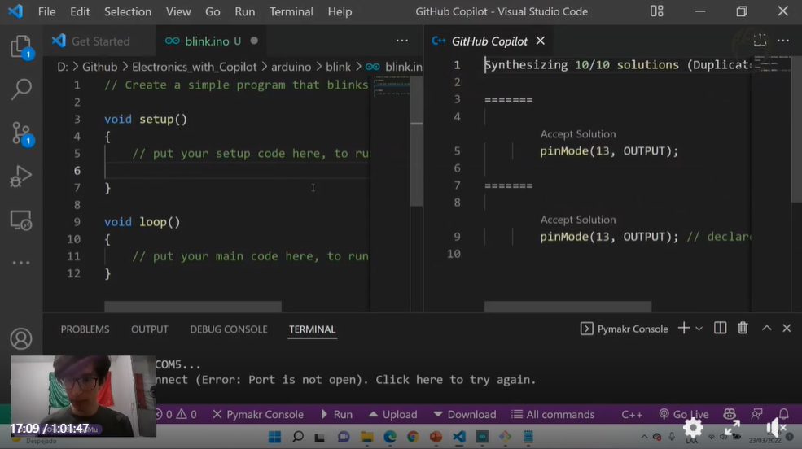
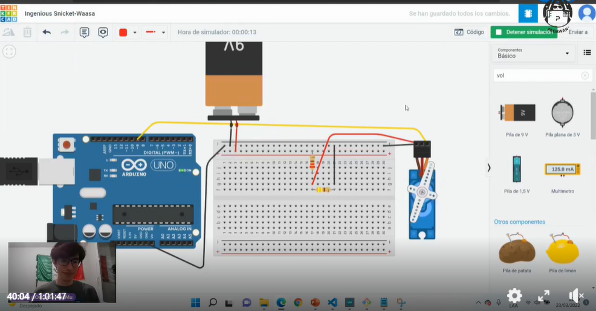

# Electronics_with_Copilot

> Workshop at Arduino Week 2022 hosted by Padawan, Hackademymx, Hackwomen communities.

Live coding with arduino and micropython examples.

## Watch the Re-Play

[https://www.facebook.com/watch/?v=356554426390458](https://www.facebook.com/watch/?v=356554426390458)
GitHub Copilot             |  Tinkercad
:-------------------------:|:-------------------------:
       |   

## Software and Tools used during the workshop

* [VSCode](https://code.visualstudio.com/)
* [Tinkercad](https://www.tinkercad.com/)

